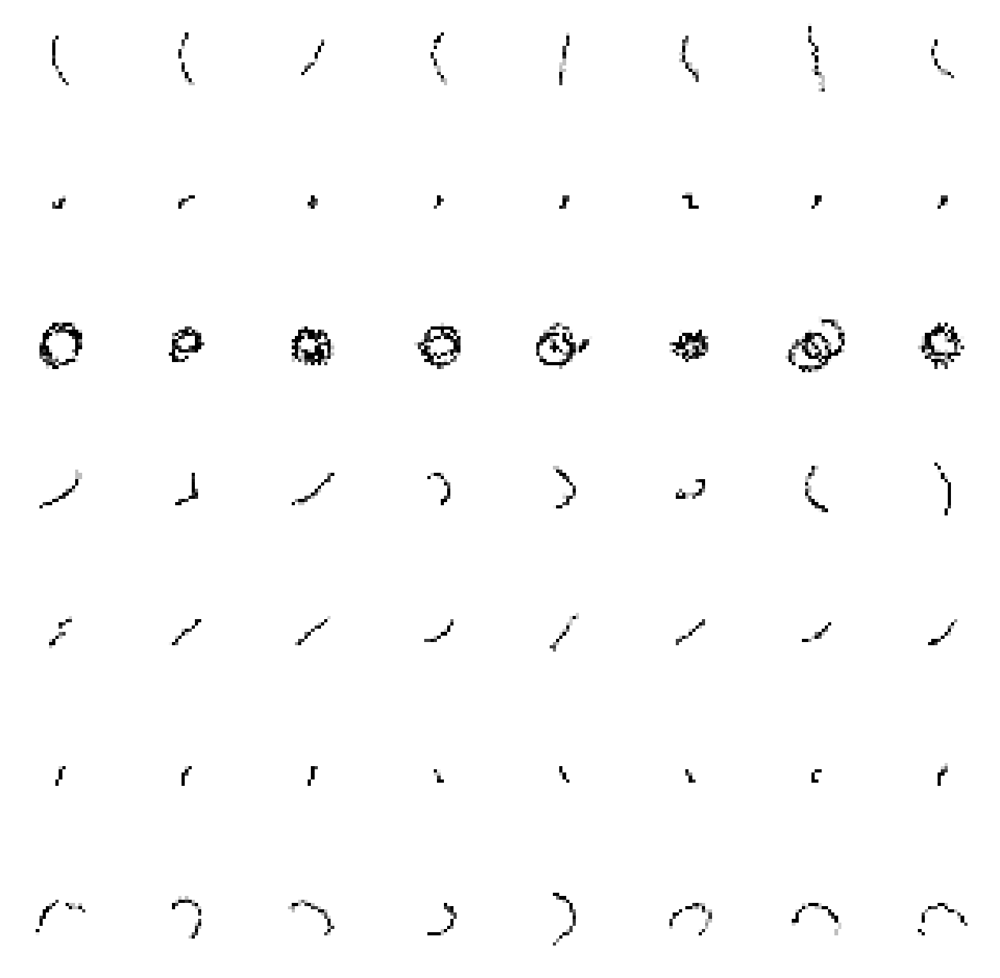

# Agrupamiento de imágenes de trayectoria utilizando SCAN

Resultados del agrupamiento.

## Instalación

Crea un ambiente virtual e instala las dependencias con `pip install -r requirements.txt`.

Solicita el dataframe new_df almacenado [aquí](https://drive.google.com/file/d/1xnotBX9mEAcosFF1qkQKNPNArzGIpRiT/view?usp=share_link) al administrador.

## Contenido

Ejecuta scan_traj-6.ipynb o scan_traj-7.ipynb para realizar el agrupamiento de imágenes. 

Las estadísticas se pueden calcular ejecutando stat.py.

## Contacto

### Administrador 
Nombre: Eder Alejandro Rodíguez Martínez.

Email: eder_rdz_mtz@hotmail.com.
